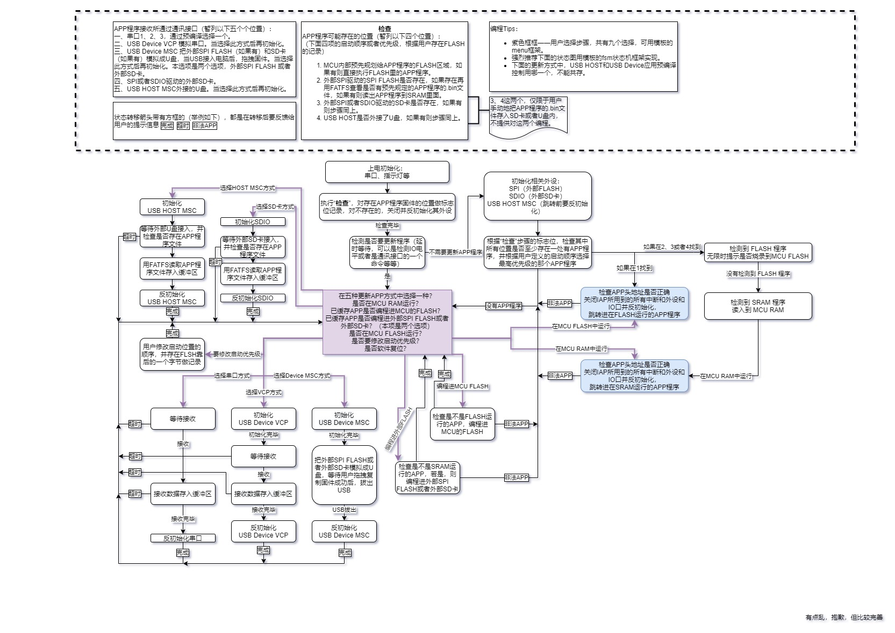

# u-IAP

```
___________________________________
  欢迎来到 u-IAP  __    __     ____  
   “瞰百易”计划   /    / |    /    )
----------------/----/__|---/____/-
  /   / ===    /    /   |  /       
_(___(______ _/_ __/____|_/________
```

一个志在实现适用于 MCU 的通用 IAP 程序框架，可以从串口、外部 SPI FLASH、外部 SDIO SD 卡、USB Device MSC 或者 USB HOST MSC等等途径更新 MCU 固件。

本项目的说明介绍等等部分遵循“二项玻”的第二则进行。本项目将在 [mcu_framework](https://github.com/Staok/stm32_framework) 项目的基础上进行，除了开源库之外的代码，每一行都经过手动移植、修改、检查和运行，是有灵魂的。喜欢的话，点个小star鸭~

本文主体内容始写于 2020.12。目前只有计划，只画了个大饼，还大概写好了菜谱，可行的路线都有，剩下的随缘；读研中比较忙，如果有人一块弄就太好了。

------

## 念课本

IAP，全称是“In-Application Programming”，中文解释为“在程序中编程”。IAP是一种对通过微控制器的对外接口（如USART，IIC，CAN，USB，以太网接口甚至是无线射频通道）对正在运行程序的微控制器进行内部程序的更新的技术（注意这完全有别于ICP或者ISP技术）。ICP（In-Circuit Programming）技术即通过在线仿真器对单片机进行程序烧写，而ISP技术则是通过单片机内置的bootloader程序引导的烧写技术。无论是ICP技术还是ISP技术，都需要有机械性的操作如连接下载线，设置跳线帽等。若产品的电路板已经层层密封在外壳中，要对其进行程序更新无疑困难重重，若产品安装于狭窄空间等难以触及的地方，更是一场灾难。但若进引入了IAP技术，则完全可以避免上述尴尬情况，而且若使用远距离或无线的数据传输方案，甚至可以实现远程编程和无线编程。这绝对是ICP或ISP技术无法做到的。某种微控制器支持IAP技术的首要前提是其必须是基于可重复编程闪存的微控制器。STM32微控制器带有可编程的内置闪存，同时STM32拥有在数量上和种类上都非常丰富的外设通信接口，因此在STM32上实现IAP技术是完全可行的。

实现IAP技术的核心是一段预先烧写在单片机内部的IAP程序。这段程序主要负责与外部的上位机软件进行握手同步，然后将通过外设通信接口将来自于上位机软件的程序数据接收后写入单片机内部指定的闪存区域，然后再跳转执行新写入的程序，最终就达到了程序更新的目的。

## 计划带纲

### 对于IAP程序工程

-   本体是在 "STM32F4DSP_HAL_freeRTOS_Framework"工程的基础上修改而成，IAP基础底层部分主要借鉴网络和官方例程而实现（均采用开源）

-   把代码写成通用的，留出接口。
    
-   修改主要围绕：（主要是为了保持 IAP 占用 FLASH 非常小）
    
    -   去掉不用的外设的驱动程序和对应的HAL库文件，只保留串口，SPI，SDIO，SFUD，FATFS，LWIP，USB等必要部分，保持IAP的最简和最小很重要！
    -   去掉不用的组件如DSP LIB，FreeRTOS，malloc，LCD和其他器件驱动，srting等等。
    -   添加IAP底层实现。
    
-   并使其实用化，规范化，实现计划详看下面的"IAP程序的两种配置"

-   严重注意，在跳转程序之前，必须先关闭IAP程序所用到的所有中断，停止其外设，并反初始化，没有用到中断的外设也都关闭，并反初始化

-   ~~注意“IAP-Bootloader 参考程序”里面的程序，串口接收APP数据时候不能中断，一中断就认为发送完了，应该改改，加个头帧和尾帧；里面的跳转和判断程序基本对，不要改动~~

-   ~~不带屏幕和sprint了怎么向外传递信息？用灯，也是我一直想做的，用两个灯表达状态信息！~~

-   仿照 u-boot，上电默认使用串口输出信息和与外界交互，使用 命令行 接收外界的控制，命令行 程序这里推荐 https://github.com/MaJerle/lwshell，如果有更好的也可以。

-   通过串口接收（USART 或 MCU Device VCP），均使用 y-modem 文件传输协议。

- 网络参考：

  -   实现——https://www.cnblogs.com/smulngy/p/5700283.html
  -   介绍——https://blog.csdn.net/ZCShouCSDN/article/details/83793309
  -   基于ymodem——https://blog.csdn.net/u010632165/article/details/103789247
  -   方案参考——https://mp.weixin.qq.com/s/YWUSDmYeo3s2j1KfbTrVBA
  -   官方总结大全，最后看——https://bbs.21ic.com/icview-2080934-1-1.html
  -   开源bootloader，https://github.com/feaser/openblt
  -   stm32-iap-uart-boot：https://github.com/havenxie/stm32-iap-uart-boot
  -   [nhivp/Awesome-Embedded: A curated list of awesome embedded programming. (github.com)](https://github.com/nhivp/Awesome-Embedded#stm32)
  -   [nhivp/Awesome-Embedded: A curated list of awesome embedded programming. (github.com)](https://github.com/nhivp/Awesome-Embedded#bootloader)
  -   ..

-   安全考虑：

    ​	防止陌生固件下载：下载之前用专有协议+非对称加密（MCU内部ID做密钥）握手，然后才可以接收数据；
    ​	防止已存固件篡改：对每个固件在第一次运行前进行一次硬件CRC校验并存下结果，在以后的启动运行固件前用硬件CRC进行一次固件校验；
    ​	防止固件被截获：对APP程序的.bin文件进行加密，传输到MCU中，MCU在下载之前进行解密（若MCU的FLASH能直接读出，那么这步白做）。

### IAP程序的两种配置

（注：最新的方案在IAP状态图.drawio文件中以状态图描述，按照这个来，下面的就仅供参考了）

（即在IAP源工程选择编译并下载后，运行时不能改动的配置）

#### 	配置一：手动

1. IAP程序下载到MCU后，等待传入APP数据或者用户选择执行APP，可以选择的接收APP二进制文件的通讯接口有：

   （注：以下是把APP二进制数据存入一个120KB的SRAM缓冲区，这个缓冲区定义在 0X20001000 地址，即APP程序在SRAM运行的地址）

   1. 串口x（x=1,2,3）（直接发文件，无需其他命令）接收数据，存入缓冲区；
   2. USB Device VCP 模拟串口接收数据，存入缓冲区；
   3. SDIO或者SPI驱动的SD卡，用FATFS扫描所有.bin文件并列出，读取SD卡内APP程序的.bin文件，存入缓冲区；
   4. USB HOST读取外部U盘，用FATFS扫描所有.bin文件并列出，读取U盘内APP程序的.bin文件，存入缓冲区；或者USB Device MSC把内部FLASH或者板载SPI FLASH模拟为U盘，在电脑端拖拽固件编程进去；
   5. 无线模块接口（如蓝牙、WIFI或者LoRa，如果是串口模块，那么接收APP数据的就是串口）接收数据，存入缓冲区。

2. APP程序传送到IAP程序的120KB缓冲区后，有三种选择：

   1. SRAM运行，即直接跳转到APP程序在SRAM运行的地址；
   2. 先把缓冲区的APP程序数据编程进MCU的FLASH（0x08010000），然后再跳转到APP程序在FLASH运行的地址；
   3. 根据用户选择，把APP程序以.bin文件形式存入检测到的外部SPI FLASH或SD卡或U盘，FLASH不宜多次反复编程，建议可以先选择（1）在SRAM运行一下看看效果，如果可以固化下来再执行（2）或（3），更不要一边接收一边编程FLASH，应该先在SRAM跑一下验证，之后再编程FLASH。

#### 配置二：自动（推荐）

1. IAP程序开机先检测是否要更新程序（可以是检测IO电平或者是通讯接口的一个命令等等）；
2. 如果没有要更新程序的命令，有以下选择：
   1. 如果有外部存储设备，且其上存在APP程序的.bin文件，则读出放在定义在 0X20001000 地址的缓冲区，直接在SRAM运行程序，这种方法可以运行放在外部存储器件中的APP程序，上流，就是很耗SRAM，不计成本可以外接SRAM；
   2. 如果没有外部存储设备，则查看MCU内部FLASH是否有APP程序文件，如果有则执行，如果没有，则进入"配置一：手动"序列等到用户手动控制存入APP数据。
3. 如果有要更新程序的命令，则进入"配置一：手动"序列等到用户手动控制存入APP数据。

## 状态框图



## APP程序工程需要的设置

APP程序可以按照以下的说明，由用户自行生成。

#### 	对于在FLASH运行

1. 在 main 主函数里面的最前面加上下面一句，设置中断向量表偏移量，以让 APP 程序的中断函数能够正确进入和返回：

   ```c
   SCB->VTOR = FLASH_BASE | 0x10000;	//0x10000（64KB） 为预留给 IAP 程序的 FLASH 空间
   ```

2. MDK 设置，在 Options for Target 里面：

   1. Target 栏：

      1. Code Generation -> 勾选 Use MicroLIB；

      2. IROM1设置：

         Start：`0x8000000 + 预留给IAP程序的 FLASH 空间（例如0x10000（64KB），结果为 0x8010000）`；

         Size：`FLASH 总容量 - 预留给 IAP 程序的 FLASH 空间（以上面为例，结果为0xF0000）`；
         *注：对于 F407ZGTx（1MB 的 FLASH），可以给 IAP 留大一些，以便 IAP 包含 USB、网络等体积较大的协议栈。*

      3. IRAM1设置：保持不变，Start 为 内存起始地址，Size 为 MCU 的内存大小，都如实填写。

   2. User 栏的 After Build/Rebuild 里面：勾选 Run #1，并在其右边栏里填入 `fromelf.exe --bin -o  .\Objects\STM32F4DSP_HAL_freeRTOS_Framework.bin .\Objects\STM32F4DSP_HAL_freeRTOS_Framework.axf`。这样在编译后会在 `.\Objects\` 里生成 APP 的 .bin 二进制文件，用于发送给 IAP 当作 APP 程序运行。`STM32F4DSP_HAL_freeRTOS_Framework.bin`为生成的 APP 二进制文件的名字，可自定，`STM32F4DSP_HAL_freeRTOS_Framework.axf`为工程名加`.axf`尾缀，`.axf`文件为 MDK 编译后生成的，利用它产生 APP 二进制文件，要填对路径。

#### 对于在SRAM运行

1. 在 main 主函数里面的最前面加上下面一句，设置中断向量表偏移量，以让 APP 程序的中断函数能够正确进入和返回：

   ```c
   SCB->VTOR = SRAM_BASE | 0x1000;		//0x10000（4KB） 为预留给 IAP 程序的 SRAM 空间，即 IAP 程序最多所占的 SRAM 大小
   ```

2. MDK 设置，在 Options for Target 里面：

   1. Target 栏：

      1. Code Generation -> 勾选 Use MicroLIB；

      2. 给存储空间做个简单的划分计算：

         以 128KB（0x20000）的 SRAM 为例，先分为 预留给 IAP 程序的 SRAM 空间、用于 APP 程序的空间 和 用于 APP RAM 的空间 三部分，以下示例，预留给 IAP 程序的 SRAM 空间为 4KB，100KB 给 APP 程序空间，24KB 给 APP RAM 的空间，则 SRAM 划分图示：

         ```
         |→    给 IAP 程序   ←||→      给 APP 程序      ←||→  给 APP 程序的 RAM ←|
         |→   4KB（0x1000）  ←||→    100KB（0x19000）   ←||→   24KB（0x6000）  ←|
         0x20000000······0x20001000·················0x2001A000········0x20020000
         ```

      3. IROM1设置为：

         Start：`0x20000000 + 预留给 IAP 程序的 SRAM 空间（例如 0x1000（4KB），结果为 0x20001000）`，即 APP 程序 的起始地址；
         Size：`SRAM 总容量 - 预留给 IAP 程序的 SRAM 空间 - 给 APP SRAM 空间（以上面为例，结果为 0x19000）`，即 APP 程序 的大小；
         *注：对于 F407ZGTx（1MB 的 FLASH），可以给 IAP 的 SRAM 留大一些（目前是 4KB），以便 IAP 包含 USB、网络等体积较大的协议栈。*

      4. IRAM1设置为：

         Start：`以上面的计算为例，结果为 0x2001A000`，即 给 APP RAM 的空间的起始地址；

         Size：`以上面的计算为例，结果为 0x6000`，即 给 APP RAM 的空间的大小。

   2. User 栏的 After Build/Rebuild 里面：勾选 Run #1，并在其右边栏里填入 `fromelf.exe --bin -o  .\Objects\STM32F4DSP_HAL_freeRTOS_Framework.bin .\Objects\STM32F4DSP_HAL_freeRTOS_Framework.axf`。这样在编译后会在 `.\Objects\` 里生成 APP 的 .bin 二进制文件，用于发送给 IAP 当作 APP 程序运行。

